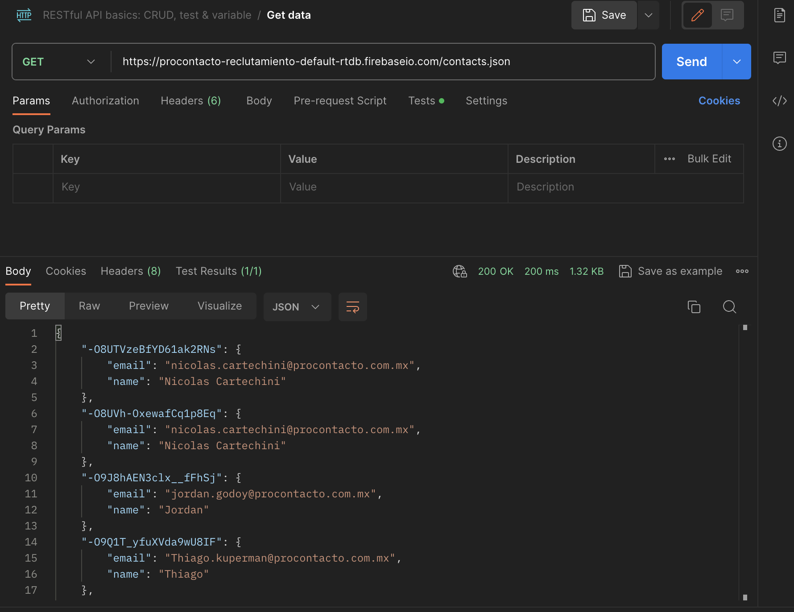
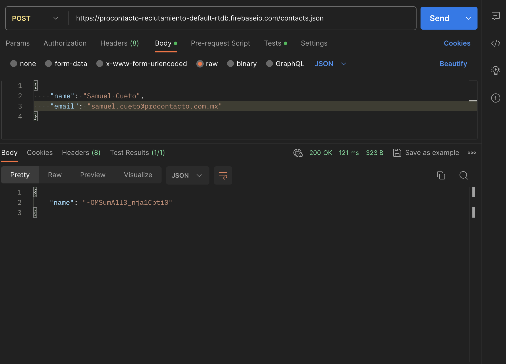
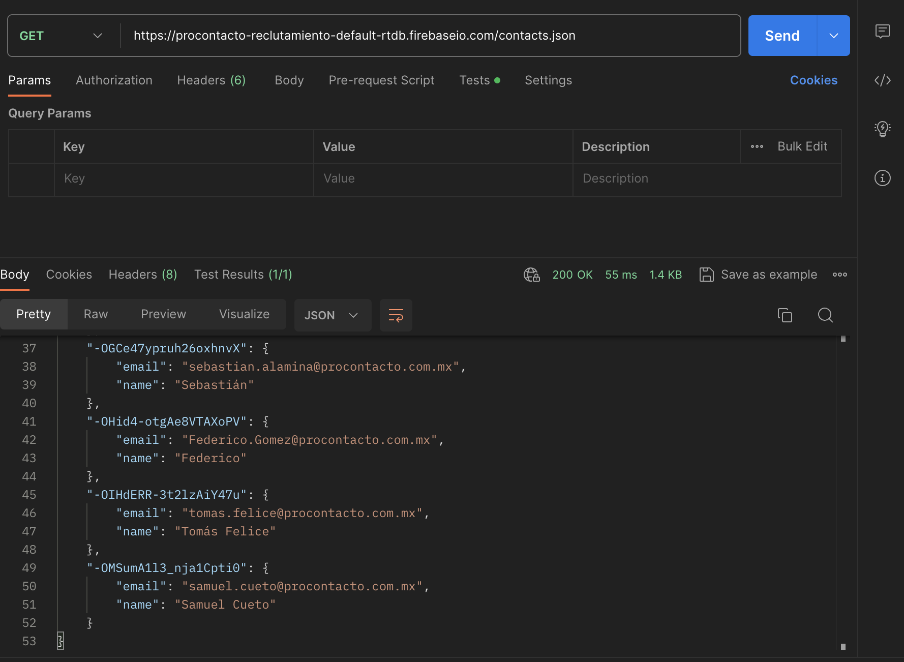
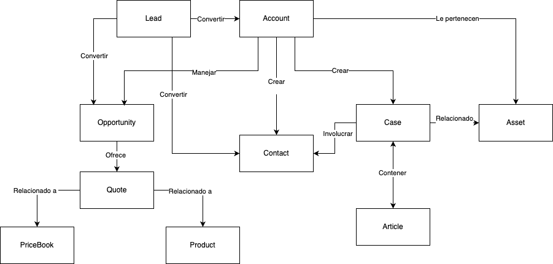
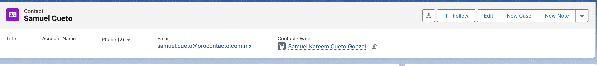

# Evaluación Práctica ProContacto

## EJERCICIO 1
Instalación del ambiente
El presente ejercicio busca realizar la instalación del ambiente para el desarrollo del trabajo práctico. A continuación se listará una serie de aplicaciones gratuitas  a instalar:

- Instalar el IDE Visual Studio Code: Un IDE (Entorno de desarrollo integrado), es una aplicación que nos brinda facilidades al momento de generar código. Dentro de Pro Contacto utilizamos Visual Studio Code para los proyectos relacionados a aplicaciones web y móviles. El mismo permite trabajar con varios lenguajes tales como: HTML, CSS, C#, Javascript, Apex, NodeJS, Angular, IONIC, React, Typescript, etc.


- Instalar GIT y GIT Bash: Git es una aplicación utilizada para el control de versionado de código. En otras palabras, es una suerte de “disco” en donde se guardarán los distintos files que componen nuestra aplicación (ejemplo: index.html, estilos.css, etc). La gran ventaja de GIT es que al momento de subir una versión nueva de un archivo, genera un “backup” de la versión anterior para poder ser restaurado cuando se desee. Además, el código se encuentra en la “nube”, por lo que puede ser accedido y descargado desde cualquier lugar que tenga acceso a internet.

## EJERCICIO 2 

Las siguientes preguntas están orientadas a la comprensión del protocolo HTTP. Son agnósticas al lenguaje de programación, la idea es comprender los conceptos del estándar:

1. ¿Qué es un servidor HTTP? 

Un servidor HTTP es una tecnología (software o hardware) capaz de responder a peticiones bajo este protocolo. Se utiliza comúnmente para brindar servicios web al cliente final, como páginas web, archivos, consultas (queries), entre otros.

2. ¿Qué son los verbos HTTP? Mencionar los más conocidos

Son acciones que se pueden realizar en una petición dentro de este protocolo. Se utilizan principalmente para realizar interacciones con el servicio proporcionado. Algunos ejemplos son enviar un formulario, cargar información en una página, entre otros. Los más populares son:

- GET 
- POST 
- PUT/PATCH 
- DELETE 

3. ¿Qué es un request y un response en una comunicación HTTP? 

Request y response son las operaciones más comunes en la comunicación entre usuario y servidor dentro de un servicio web.

Request (solicitud): Es la petición que envía el cliente o usuario a un servidor HTTP para realizar una consulta. Está compuesta por el tipo de petición (puede ser cualquier verbo mencionado anteriormente) y la URL a la que se está haciendo la solicitud. 

Response (respuesta): Es la respuesta que ofrece el servidor a la solicitud del usuario. Generalmente, incluye un código de estado que indica el resultado de la petición. Estos códigos se clasifican en las siguientes categorías:

- 100 → Respuestas informativas.
- 200 → Respuestas exitosas.
- 300 → Redirecciones.
- 400 → Errores del cliente.
- 500 → Errores del servidor.

Se explicarán más a detalle en el la pregunta 5

 ¿Qué son los headers? 

Son información adicional que se envía con una petición (request y response) y facilitan la comunicación entre el cliente y el servidor. Generalmente, los headers se envían como pares clave-valor, donde se establecen aspectos como formatos de datos, autenticación, permisos de acceso, entre otros.

4. ¿Qué es un queryString? (En el contexto de una url)

Es un conjunto de parámetros agregados a la URL que, al igual que los headers, se manejan como pares clave-valor. Su función principal es enviar información extra en la petición y se indica después del símbolo de interrogación (?).

	https://www.test-procontacto.com.mx/query?usuario=admin&index=1239

Aquí, `usuario=admin` e `index=1239` son parámetros del query string dentro del endpoint de la URL.

5. ¿Qué es el responseCode? ¿Qué significado tiene los posibles valores devueltos?

Los códigos de respuesta HTTP se clasifican de la siguiente manera:

- 100 → Respuestas informativas o de espera de interacción.

- 200 → Respuestas exitosas del servidor.

- 300 → Redirecciones de URL (cuando el dominio o la dirección ha cambiado).

- 400 → Errores del usuario (peticiones inexistentes, prohibidas o incorrectas).

- 500 → Errores del servidor (fallas internas al procesar la petición).


6. ¿Cómo se envía la data en un Get y cómo en un POST? 

GET: Los datos se envían a través de query strings en la URL como pares clave-valor. Estos valores pueden provenir de inputs en una página o aplicación que requiera datos del usuario para obtener una respuesta.


POST: Los datos se envían generalmente en formato JSON (JavaScript Object Notation) en el cuerpo de la petición. Un ejemplo de datos en JSON sería:

```json
{
  "puesto": "desarrollador",
  "nombre": "Samuel"
}
```


7. ¿Qué verbo http utiliza el navegador cuando accedemos a una página?

El navegador utiliza principalmente GET, ya que al acceder a una URL se está realizando una consulta al servidor.

La respuesta a esta petición incluye el HTML, CSS, JavaScript, imágenes, etc., que el navegador renderiza y muestra al usuario.

Es importante mencionar que en ciertas tecnologías GET también se usa para hacer consultas a bases de datos (por ejemplo, en frameworks como Express.js, facilitando la interacción entre cliente y servidor).

8. Explicar brevemente qué son las estructuras de datos JSON y XML dando ejemplo de estructuras posibles.

Ambas estructuras se utilizan para el transporte de datos en servicios web o consultas a APIs.

JSON (JavaScript Object Notation): Es el formato más común. Su sintaxis se basa en pares clave-valor y es fácil de leer. Admite varios tipos de datos (cadenas, números, objetos, arreglos, etc.).

```json
{
  "nombre": "Samuel",
  "edad": 24,
  "correo": "samuelcueto.2000@gmail.com",
  "Lenguajes": ["Java", "Python", "JavaScript"]
}
```

XML (eXtensible Markup Language): Utiliza etiquetas para estructurar los datos, similar a HTML. Es más difícil de leer, pero ofrece una organización más estricta. Se usa más en SOAP, mientras que JSON es preferido en REST.

```xml
<usuario>
	<nombre>Samuel</nombre>
	<edad>24</edad>
	<correo>samuelcueto.2000@gmail.com</correo>
	<lenguajes>
		<lenguaje>Java</lenguaje>
		<lenguaje>Python</lenguaje>
		<lenguaje>JavaScript</lenguaje>
	</lenguajes>
</ usuario>
```


9. Explicar brevemente el estándar SOAP

SOAP (Simple Object Access Protocol) es un protocolo utilizado principalmente con XML. Su propósito es permitir la comunicación estructurada entre sistemas, definiendo pautas para la estructura de los mensajes y la interacción entre servicios web. SOAP es funcional con HTTP y otros protocolos.

 
10. Explicar brevemente el estándar REST Full

RESTFul (Representational State Transfer) es un estándar arquitectónico ampliamente utilizado con HTTP/HTTPS. Se basa en el uso de verbos HTTP para la comunicación entre sistemas y puede manejar varios formatos de datos (JSON, XML, etc.), aunque JSON es el más común.

REST es clave en la mayoría de las APIs modernas debido a su simplicidad y compatibilidad con múltiples tecnologías.

11. ¿Qué son los headers en un request? ¿Para qué se utiliza el key Content-type en un header?

Los headers son datos adicionales enviados en una petición HTTP (GET, POST, etc.). Su función principal es definir aspectos clave de la comunicación, como el formato de datos, autenticación, permisos, etc.

El header `Content-Type` indica el formato del contenido enviado en el cuerpo de la petición.

`Content-Type: application/json`

Esto indica que el servidor debe esperar un contenido en formato JSON.

## EJERCICIO 3

Recomendamos previamente entender los conceptos de la sintaxis “JSON” antes de arrancar con los ejercicios.
Descargar el POSTMAN (aplicación para realizar request como cliente), adjuntando un screen de resolución para cada ítem:

1. Realizar un request GET a la URL: https://procontacto-reclutamiento-default-rtdb.firebaseio.com/contacts.json



2. Realizar un request POST a la URL anterior, y con body:
```json
{
"name":"Tu nombre",
"email":tunombre.tuapellido@procontacto.com.mx
}
```
Tip: (Marcar la opción “raw” como body)



3. Realizar nuevamente un request GET a la URL: https://procontacto-reclutamiento-default-rtdb.firebaseio.com/contacts.json



¿Qué diferencias se observan entre las llamadas el punto 1 y 3?

Inicialmente se realizó una petición a la URL proporcionada, el cuál regresa los valores que requiere dicha petición. En este caso no existe algún filtro o body puesto que solo queremos obtener ciertos valores.

En el punto 3, puesto que realizamos un POST (una actualización de formulario en este caso) y regresó la llamada con una respuesta tipo 200 (exitosa). Al volver a realizar dicha petición, podemos observar al final un nuevo valor agregado (el POST del inciso 2). Corroborando que exitosamente se realizó la petición POST a dicha URL.

Es importante mencionar, a pesar que es la misma URL, este sabe distinguir entre las peticiones debido al verbo utilizado (uno fue GET y otro POST). Y así el servidor logra identificar qué operación requiere el usuario al momento de hacer una llamada al servidor.

## EJERCICIO 4 

Cambiar el idioma de Trailhead a inglés.
Realizar los siguientes módulos de Trailhead:

- [Fundamento de la plataforma Salesforce](https://trailhead.salesforce.com/content/learn/modules/starting_force_com)
- [Fundamentos de Apex y .NET](https://trailhead.salesforce.com/content/learn/modules/apex_basics_dotnet?trailmix_creator_id=strailhead&trailmix_slug=prepare-for-your-salesforce-platform-developer-i-credential)
- [Modelado de datos](https://trailhead.salesforce.com/content/learn/modules/data_modeling?trailmix_creator_id=strailhead&trailmix_slug=prepare-for-your-salesforce-platform-developer-i-credential)
- [Fundamentos y base de datos de Apex](https://trailhead.salesforce.com/content/learn/modules/apex_database?trailmix_creator_id=strailhead&trailmix_slug=prepare-for-your-salesforce-platform-developer-i-credential)
- [Desencadenadores de Apex](https://trailhead.salesforce.com/content/learn/modules/apex_triggers?trailmix_creator_id=strailhead&trailmix_slug=prepare-for-your-salesforce-platform-developer-i-credential)
- [Apex Integration Services](https://trailhead.salesforce.com/en/content/learn/modules/apex_integration_services)

Cuenta Trailhead (algunos cursos fueron realizados hace 2 años, por lo que la fecha de resolución esta marcada a la primera vez que se completo el curso) 
https://www.salesforce.com/trailblazer/scueto4 


## EJERCICIO 5 

Explicar que son conceptualmente, qué datos almacenan en forma estándar y cómo se relacionan el resto (algunos no se relacionan entre sí) cada uno de los siguientes objetos de Salesforce:

1. Lead - Hace referencia a un cliente potencial, el cual muestra interés en el manejo de un servicio o producto de una empresa. 

Datos almacenados - Algunos ejemplos son: Nombre, información del contacto (correo electrónico, número telefónico), situación actual (Nuevo, calificado, no calificado, contactado, etc.).  
		Relación - No existe una relación directa, sin embargo dicho Lead se puede convertir después en un tipo de Account, Contact Opportunity.

2. Account - Representa a una entidad o empresa con la que una organización mantiene una relación de estilo comercial (socios, proveedores, etc.). 

		Datos almacenados - Nombre de la entidad, giro de la industria, dirección, tipo de cuenta (cliente, proveedor, etc.).

3. Contact - Es la representación de un usuario o persona dentro de una organización (empresa) donde se realizan ciertas interacciones.
	
		Datos almacenados - Nombre (apellidos), cargo o posición, información de contacto (correo electrónico, número telefónico), asociación a la que pertenece

4. Opportunity - Es la representación de una venta potencial que se encuentra en proceso. Su principal función es llevar el seguimiento de las posibles ventas.

	Datos almacenados - Nombre de la oportunidad, en que paso se encuentra ubicado, monto, ETA (Estimated time of Arrival). 
	
5. Product - El tipo de servicio o producto que la organización vende

		Datos estándares almacenados: Nombre del producto, identificador (código del producto). Descripción, precio.

6. PriceBook - Como su nombre lo sugiere, es una lista de precios de ciertos productos. Estos varían dependiendo el tipo de cliente o acuerdos que existan entre comerciantes.

	Datos almacenados - Nombre de la lista, productos asociados a la lista, precios (por acuerdos).

7. Quote - Es la representación de una propuesta final y formal que será compartida con el cliente.

		Datos almacenados - Nombre, monto total, productos incluídos, estado de la cotización.

8. Asset - Son aquellos productos que un determinado cliente ya aceptó, y actualmente ya posee o está utilizando.

	Datos almacenados - Nombre, código de activo, estado del activo (Funcional, no funcional, etc.). Account propietario del activo.

9. Case - Representado por una solicitud o ticket, donde se reporta algún inconveniente con un servicio o producto solicitado por el cliente.

		Datos almacenados - Título o asunto, descripción, estado actual (activo, en proceso, resuelto o cerrado). Nivel de prioridad. 

10. Article - Hace referencia a la documentación que soporta la plataforma de Salesforce, su principal función es para la resolución de problemas en la plataforma.

Datos almacenados - Título, descripción, fecha, categoría. 

Diagrama de relaciones



## EJERCICIO 6 

Responder las siguientes preguntas brevemente sobre:

### Soluciones de Salesforce

A. ¿Qué es Salesforce?

Salesforce es una plataforma de estilo CRM (Customer Relationship Management) en formato de cloud. Su principal funcionalidad es la gestión de ventas y servicio a clientes. Manejo de marketing y su enfoque principal es en el manejo de datos y automatizar procesos.

B. ¿Qué es Sales Cloud?

Como su nombre lo sugiere, es una solución enfocada en la gestión de ventas de una empresa. Ayuda a las áreas comerciales interesadas en el manejo de oportunidades, automatización de tareas, manejo de leads, entre otras.

C. ¿Qué es Service Cloud?

Una solución de Salesforce, su enfoque principal es el customer success. Entre sus principales funcionalidades está el manejo de casos de soporte, la automatización de respuestas. Integración de mensajería y asistencia que facilita la experiencia del cliente. 

D. ¿Qué es Health Cloud?

Es una solución de Salesforce orientada al sector de salud. Entre sus cualidades están el manejo de pacientes o historiales clínicos, manejo de aseguradoras y proveedores enfocados en el sector de la salud. 

E. ¿Qué es Marketing Cloud?

Es una plataforma para la automatización de procesos enfocados en el marketing. Salesforce permite la personalización de campañas publicitarias, automatización de correos, manejos de datos para su análisis y mejorar con la retención de clientes. 

### Funcionalidades de Salesforce

A. ¿Qué es un RecordType?

Permite la personalización de distintos registros dentro de un mismo objeto, manejando campos, layouts y flujos de negocio dependiendo el tipo de registro que se desee trabajar.  

Ejemplo: Una organización tiene un RecordType para unos Usuarios y Proveedores. Dentro de un objeto de estilo Account, a pesar que ambos sean de ese objeto, manejan campos y diseños distintos para cada uno.

B. ¿Qué es un ReportType?

Define relaciones que están disponibles para la generación de reportes dentro de Salesforce. Determina qué campos y objetos pueden ser consultados, incluye objetos con relaciones y existe la posibilidad de personalizarlos de acuerdo del negocio. 

Ejemplo: La combinación de una Opportunity con Productos vendidos para marcar pautas en el análisis de ventas.

C. ¿Qué es un Page Layout?

Es el controlador de cómo se representan visualmente los campos, secciones, botones dentro de un registro. Es importante mencionar que la forma que se representan los datos pueden variar o ser diferentes según el perfil de usuario que esté interactuando.

Ejemplo: Un Page layout de un director podría mostrar la información completa de un cliente, a diferencia de un usuario de ventas solo los datos de contacto necesarios.

D. ¿Qué es un Compact Layout?

Similar a Page Layout, simplifica los campos necesarios para la visualización de un registro. El mayor beneficio es para dar una mejor previsión de información sin la necesidad de representar todos los datos.

Ejemplo: Sin abrir el registro, puedes ver el Nombre y correo de un proveedor, sin la necesidad de abrirlo (No es necesario ver más información como la dirección del proveedor para saber a quién se refiere dicho registro).

E. ¿Qué es un perfil?

Es el definidor de los permisos y el control de accesos que contiene un usuario que interactúa con la solución. Manejo de CRUD’s, acceso a reportes, análisis de información o automatizaciones de procesos, existen ciertos perfiles predefinidos o es posible personalizar según el criterio del cliente.

Ejemplo: Un perfil de administrador tendrá más accesos como todas las ventas y análisis de tendencias, pero uno de ventas solo será capaz de ver sus propias oportunidades (sin la de otros vendedores).
 
F. ¿Qué es un Rol?

Es la definición de jerarquía en el acceso de información dentro de la organización. No funciona para la restricción de accesos, sino solo quién tiene la autorización de visualizar ciertos datos.

Ejemplo: Un rol gerencial puede ver los Leads de sus vendedores. Sin embargo, un vendedor solo podrá visualizar aquellos en los que es dueño.

G. ¿Qué es un Validation Rule?

Son pautas o reglas que las soluciones manejan para evitar que los datos sean registrados erróneamente:

Ejemplo: Introducción de letras en un campo de edad. Marcar una oportunidad vendida sin un monto de venta sería un candidato de validación para que siempre se registre la cantidad en el apartado de monto total.

H. ¿Qué diferencia hay entre una relación Master Detail y Lookup?

Son dependencias de valores y hacen referencia a la “fuerza” que están marcadas sus relaciones. 

Master-Detail - Maneja una relación dependiente, donde la dependencia es heredada y si el campo padre es eliminado, igualmente sería su hija. 

Lookup -Más independiente, donde no están relacionados unos con los otros. Y la eliminación de uno, la existencia del otro queda intacta.  

I. ¿Qué es un Sandbox?

Se pueden considerar como ambientes de prueba que ofrecen para el desarrollo y pruebas de un producto sin manipular la base de datos en producción. Se pueden manejar copias exactas, parciales o en desarrollo en comparación a las de producción. 

J.¿Qué es un ChangeSet?

Es una herramienta para la personalización y configuración de ambientes que ofrece Salesforce (Sandbox, producción). Es principalmente para el manejo de configuraciones, no de datos.

K. ¿Para qué sirve el import Wizard de Salesforce?

Sirve para la actualización e importación de datos en Salesforce. Es funcional para cargar Leads, Contacts, Accounts, Opportunities, etc. Con funcionalidades como validación automática que evita duplicados.

L. ¿Para qué sirve la funcionalidad Web to Lead?

Funciona para la captura de clientes potenciales desde un sitio web, este crea un Lead automáticamente en la solución de Salesforce. Funcional para generar prospectos de manera automática. Un ejemplo podría ser un formulario en una plataforma web, y una vez enviada se crea un Lead para futuro seguimiento.

M. ¿Para qué sirve la funcionalidad Web to Case?

Su principal función es para que los clientes, por medio de un sitio web, sean capaces de generar una solicitud de soporte. Esto con la finalidad de facilitar la gestión del soporte con la atención al cliente.

N. ¿Para qué sirve la funcionalidad Omnichannel?

Su principal función es para la distribución de cargas entre Cases, Task, Leads, etc. Dependiendo de la carga de trabajo. De esta forma se brinda un mejor servicio al cliente.
 
O. ¿Para qué sirve la funcionalidad Chatter?

Similar a una red social, es una herramienta que potencia la colaboración en la plataforma de Salesforce, brindando a los usuarios un medio de comunicación donde pueden conversar, compartir información relevante y llevar seguimiento a registros.

### Conceptos generales

A. ¿Qué significa SaaS?

Software as a Service, es un estilo de distribución de software donde la aplicación se encuentra en la nube y los usuarios acceden por medio del internet sin la necesidad de instalar la aplicación de manera local.

B. ¿Salesforce es Saas?

Si, se considera un Saas ya que sus servicios de CRM (u otro mencionado anteriormente) se encuentran en la nube, permitiendo la gestión empresarial de una organización sin la necesidad de infraestructura local.

C. ¿Qué significa que una solución sea Cloud?

Una solución cloud significa que no hay una instalación local de aplicaciones, sino que se aloja remotamente y es accesible por medio del internet. Esto brinda más escalabilidad y accesibilidad a servicios desde cualquier lugar.

D. ¿Qué significa que una solución sea On-Premise?

A diferencia del SaaS, una solución On-Premise significa que la instalación y ejecución de la aplicación se realiza de manera local en la empresa. La principal razón es para tener un mayor control de la infraestructura y mayor seguridad (esto requiere más inversión en hardware).

E. ¿Qué es un pipeline de ventas?

Se considera como una serie de pasos o procesos que sigue un candidato hasta llegar a un cliente oficial de una organización.

Un ejemplo orientado a Salesforce, podría ser la transición de una Lead hasta la creación de una Account (pasando por un estado calificado, negociación, trato, cierre).

F. ¿Qué es un funnel de ventas?

Similar al pipeline de ventas, es el camino esperado que transcurre un cliente potencial a la adquisición de una compra, pasando desde el conocimiento, la consideración, la decisión hasta convertirse en una compra.

G. ¿Qué significa Customer Experience?

Es la percepción que vive un cliente al interactuar con una organización, con base en la experiencia que vive con la misma. Desde la atención al cliente, facilidad de un producto, respuesta de soporte, entre otras. Brinda lealtad y recomendación cuando se ejecuta de manera adecuada.

H. ¿Qué significa omnicanalidad?

Es una estrategia para ofrecer una experiencia de cliente integrada por múltiples canales de comunicación. Entre las opciones podrían ser interacción física, chats, web, redes sociales, entre otras. Con la idea que se puedan manejar varios canales de comunicación sin la necesidad de repetir todos los datos cada vez que se utiliza otro canal.

I. ¿Qué significa que un negocio sea B2B?¿Qué significa que un negocio sea B2C?¿Qué es un KPI?

Un negocio Business to Business es la manera de vender servicios o productos a otras empresas en lugar de a un usuario final.

Un negocio B2C (Business to Consumer). Es cuando una empresa vende sus productos o servicios al usuario final. Un ejemplo sería Netflix, donde su plataforma llega aquellos consumidores de sus películas

Un KPI (Key Performance Indicator) es el indicador clave por el cual se mide el éxito de un proceso. Para que algo se pueda considerar un KPI, es importante que sea específico y medible de tal manera que se pueda medir de manera relevante. Un ejemplo es las ventas mensuales que generan ciertos vendedores.
 
J. ¿Qué es una API y en qué se diferencia de una Rest API?

Un Application Programming Interface son conjunto de pautas que nos ayudan a la comunicación entre dos sistemas independientes, funciona como especie de middleware para la interacción entre sí.

Una Rest API es un API que utiliza la arquitectura REST (definida en el ejercicio 2, punto 11). que se apoya del protocolo HTTP para la implementación de una aplicación web con sistemas independientes que interactúan. 

K. ¿Qué es un Proceso Batch?

Son procesos de ejecución que se manejan en conjunto (o lote) para el manejo de gran volumen de información. Como la actualización de datos en inventario a clientes externos. 

L. ¿Qué es Kanban?

Es una metodología de gestión visual que trabaja por medio de tablas para la representación del estado de tareas, las clasificaciones más comunes suelen ser Tareas pendientes, en proceso y terminado. Sirve para el flujo de trabajo de manera eficiente (Un ejemplo de una plataforma es Trello).

M. ¿Qué es un ERP? 

Enterprise Resource Planning, es un software que busca la integración de varios sectores de una empresa. Ejemplo sería la integración de ventas, inventario, finanzas y producción en una misma solución.

N. ¿Salesforce es un ERP?

No se podría considerar un ERP, puesto a que Salesforce tiene un enfoque más al manejo de recursos y personal y no la integración de manejo de inventarios y contabilidad de un producto o servicio. 

## EJERCICIO 7 

El código de este ejercicio también subirlo al Repositorio. Realizar las siguientes actividades sobre el Playground 1 del ejercicio 4:

1. Consultar tu ID haciendo un GET con POSTMAN a este WS:
https://procontacto-reclutamiento-default-rtdb.firebaseio.com/contacts.json
Por ejemplo lo resaltado en la imagen es mi ID:

Utilizarás este ID para probar la funcionalidad construida a continuación.

2. Agregar un campo al objeto Contact llamado idprocontacto de tipo texto de 255 caracteres. De la siguiente manera:

No omitir poner el siguiente check cuando se crea el campo.


3. Desarrollar un trigger para que cuando un usuario Modifica o Crea un contacto de Salesforce completando el campo generado en el punto B, se invoque al Web Service del punto A y que con el campo idprocontacto obtenga los datos de email de la respuesta y actualice el campo email del contacto. Usar Playground 1. 
- Recuerda que puedes usar tu ID obtenido en el punto A para probar la funcionalidad.
- Recuerda el módulo realizado sobre callouts de tipo REST.
- Para consultar un contacto en particular se puede agregar al ID al final de la URL como en este ejemplo: https://procontacto-reclutamiento-default-rtdb.firebaseio.com/contacts/-Ma6nC5l7n2nVal2zCyR.json


Desarrollo se encuentra dentro de la carpeta `src/` con el trigger, el service y el handler que fueron necesarios para el desarrollo

Para probar, cree un ejemplo de un nuevo Contact:
```
Contact testContact = new Contact(
    FirstName = 'Samuel',
    LastName = 'Cueto',
    Email = 'oldemailshouldnotwrite@example.com',  // This email should not show, rather update with endpoint email
    idprocontacto__c = '-OMSumA1l3_nja1Cpti0' 
);
insert testContact;
```
Y se puede observar como se actualizo el correo (no agrego el Email inicialmente establecido):



